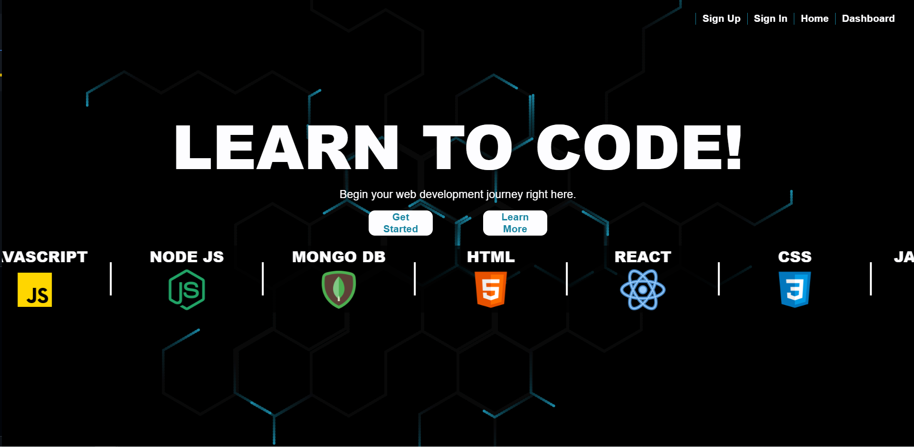
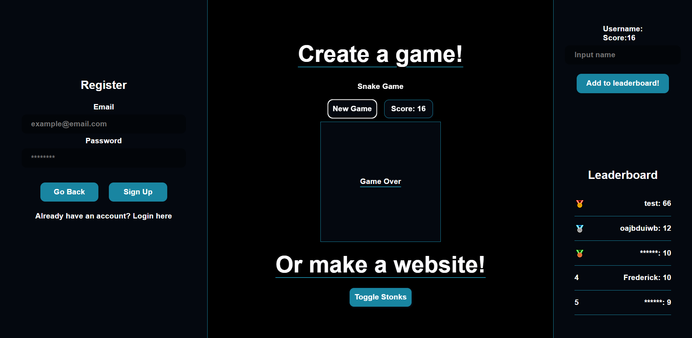
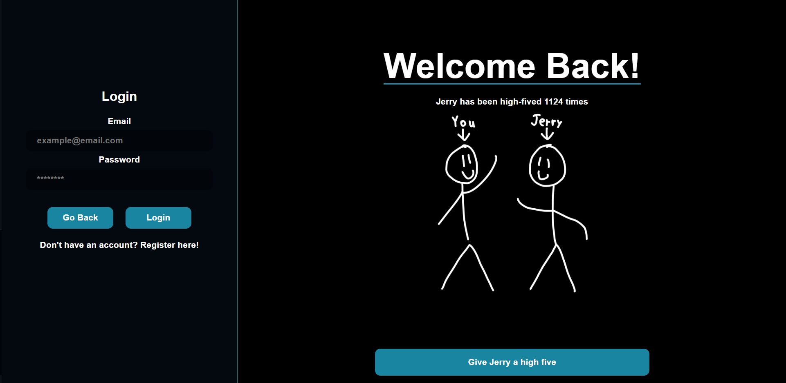
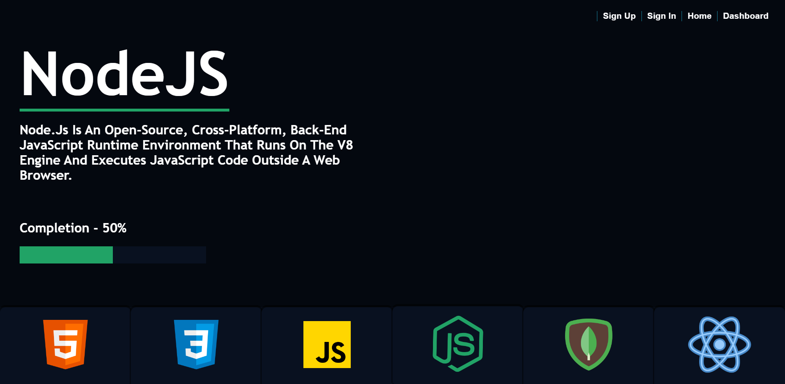

# MERN Stack Educational Site (name needed)

## Web application dedicated to teaching the entire MERN tech stack

### Technologies taught include

- HTML
- CSS
- Javascript
- NodeJS
- React
- MongoDB

### This site was designed to utilize the technologies intended to be taught within it, as to allow for the website itself to be used as a reference.

---

## **Pages**

---

### **Home Page**

- Landing page of application
- [Link to Page]() **Note: will not work as website is not deployed yet**
  

Features:

1. Navbar for accessing relevant pages.
2. Animated Background utilizing [tsParticles](https://particles.js.org/)
3. Slider animation utilizing CSS transform property.

Technologies used:

1. [tsParticles (Background)](https://particles.js.org/)
2. [React (Framework)](https://react.dev/)
3. [CSS (Styling)](https://www.w3schools.com/css/)

---

### **Register Page**

- Register page of application
- [Link to Page]() **Note: will not work as website is not deployed yet**
  

Features:

1. Fully functional Register form with error handling and links to Login Page or back to the Home Page. User data is stored in a [MongoDB](https://www.mongodb.com/) collection via an [Apollo/GraphQL](https://www.apollographql.com/docs/) mutation handled on the backend.
2. JSON Web Token ([JWT](https://jwt.io/)) recieved from registration and cached on users machine with localStorage in order to maintain the user as logged in once redirected to another page.
3. User password is encrypted utilizing [bcrypt](https://www.npmjs.com/package/bcrypt) before storage to ensure security.
4. Animated Background utilizing [tsParticles](https://particles.js.org/) **Note: Background is activated on button click**
5. Snake game created with [React's](https://react.dev/) useState/useEffect hooks and some [CSS](https://www.w3schools.com/css/).
6. Leaderboard to track players score for the Snake game and store the players score into a [MongoDB](https://www.mongodb.com/) collection and display the top five players via an [Apollo/GraphQL](https://www.apollographql.com/docs/) query handled on the backend.
7. [Bad words API](https://apilayer.com/marketplace/bad_words-api) when requesting a score to be saved in order to detect and prevent inapropriate names from showing up on the leaderboard. **Note: Names will still appear, just censored**

Technologies used:

1. [tsParticles (Background)](https://particles.js.org/)
2. [bcrypt (Password Encryption)](https://www.npmjs.com/package/bcrypt)
3. [React (Framework)](https://react.dev/)
4. [CSS (Styling)](https://www.w3schools.com/css/)
5. [MongoDB (Database)](https://www.mongodb.com/)
6. [Apollo/GraphQL (Server)](https://www.apollographql.com/docs/)
7. [Bad words API (Profanity Filter)](https://apilayer.com/marketplace/bad_words-api)
8. [JWT (Web Token)](https://jwt.io/)

---

### **Login Page**

- Login Page for Application
- [Link to Page]() **Note: will not work as website is not deployed yet**
  

Features:

1. Fully functional Login form with error handling and links to the Register Page or back to the Home Page. User data is stored in a [MongoDB](https://www.mongodb.com/) collection via an [Apollo/GraphQL](https://www.apollographql.com/docs/) mutation handled on the backend.
2. JSON Web Token ([JWT](https://jwt.io/)) recieved from login and cached on users machine with localStorage in order to maintain the user as logged in once redirected to another page.
3. [Apollo/GraphQL](https://www.apollographql.com/docs/react/api/link/apollo-link-ws/) websocket server dedicated to update the number of times Jerry has been high fived live across all users. An [Apollo/GraphQL](https://www.apollographql.com/docs/) server mutation is sent on clicking the high five to increment the total number in the [MongoDB](https://www.mongodb.com/) collection, simultaneously updating all the users via the websocket.
4. High Five animation made with [React ](https://react.dev/) and its corresponding useState hook.

Technologies used:

1. [JWT (Web Token)](https://jwt.io/)
2. [React (Framework)](https://react.dev/)
3. [CSS (Styling)](https://www.w3schools.com/css/)
4. [MongoDB (Database)](https://www.mongodb.com/)
5. [Apollo/GraphQL (Server)](https://www.apollographql.com/docs/)
6. [Apollo/GraphQL (Websocket)](https://www.apollographql.com/docs/react/api/link/apollo-link-ws/)

### **Dashboard Page** **(WIP)**

- Dashboard where users can access the specific courses and view their percentage completion.
- [Link to Page]() **Note: will not work as website is not deployed yet**
  

Features:

1. Largely animated utilizing [React (useState, useEffect)](https://react.dev/) and [CSS](https://www.w3schools.com/css/)
2. **(WIP)** Completion Percentage (%) is stored in a MongoDB Collection and accessed via the GraphQL API. **(WIP)**

Technologies used:

1. [React (Framework)](https://react.dev/)
2. [CSS (Styling)](https://www.w3schools.com/css/)

---
